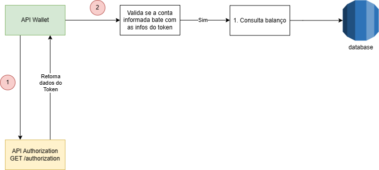
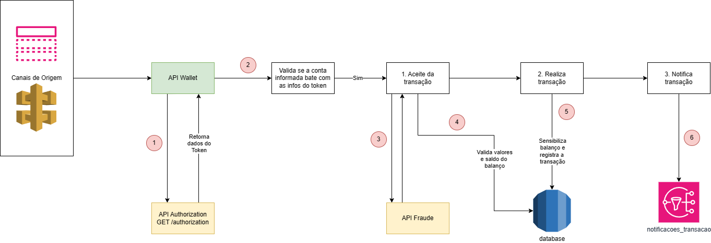

# Simple Wallet

Descrição breve do projeto.

## Tecnologias Utilizadas

- Java
- Spring Boot
- MySQL
- Kafka
- Wiremock

## Configuração do Projeto

### 1. Clonar o Repositório

```bash
git clone https://github.com/henrique-cesar/simple-wallet.git
```

### 2. Importar o Projeto

- Abra o projeto em sua IDE (por exemplo, IntelliJ IDEA, Eclipse).
- Aguarde a importação das dependências do Maven/Gradle.

### 3. Configurar o Banco de Dados

- Certifique-se de ter um banco de dados configurado localmente ou em um servidor remoto. (Se preferir use o docker-compose do projeto para iniciar uma instância do MySQL).
- Atualize as configurações do banco de dados no arquivo `application.properties`.

### 4. Executar o Projeto

- Execute a aplicação Spring Boot.
- Verifique se a aplicação está sendo executada corretamente.

### 5. Acessar a Documentação

- Após iniciar a aplicação, acesse a documentação do Swagger no seguinte URL: `http://localhost:8888/swagger-ui/index.html`

Claro, aqui está a seção de Funcionalidades Principais com os endpoints que você mencionou:

### 6. Funcionalidades Principais

1. **Endpoint para Consultar Saldo do Balanço**

    - Método: GET
    - URL: `/api/accounts/{accountId}/balances/{balanceId}`
    - Descrição: Retorna o saldo do balanço para uma conta específica.
    - Parâmetros de Path:
        - `accountId`: ID da conta para consulta.
        - `balanceId`: ID do balanço para consulta.

2. **Endpoint para Consultar Extrato**

    - Método: GET
    - URL: `/api/accounts/{accountId}/balances/{balanceId}/extract`
    - Descrição: Retorna o extrato de transações para um balanço específico.
    - Parâmetros de Path:
        - `accountId`: ID da conta para consulta.
        - `balanceId`: ID do balanço para consulta.
    - Parâmetros de Query (Opcional):
        - `type`: Tipo de transação para filtrar o extrato (opcional).

3. **Endpoint para Realizar Transação**

    - Método: PUT
    - URL: `/api/accounts/{accountId}/transactions`
    - Descrição: Realiza a transação.
    - Parâmetros de Query:
        - `token`: Token de autorização.

## Contribuição

- Clone o repositório.
- Crie uma branch para sua feature (`git checkout -b feature/nome-da-feature`).
- Faça commit das suas alterações (`git commit -am 'feat: Adicionando nova feature'`).
- Faça push da branch (`git push origin feature/nome-da-feature`).
- Crie um novo Pull Request.

## Autores

- Henrique César

---

## Fluxogramas

### Consultar saldo


### Consultar extrato


### Gerar transação

